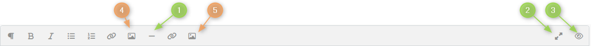
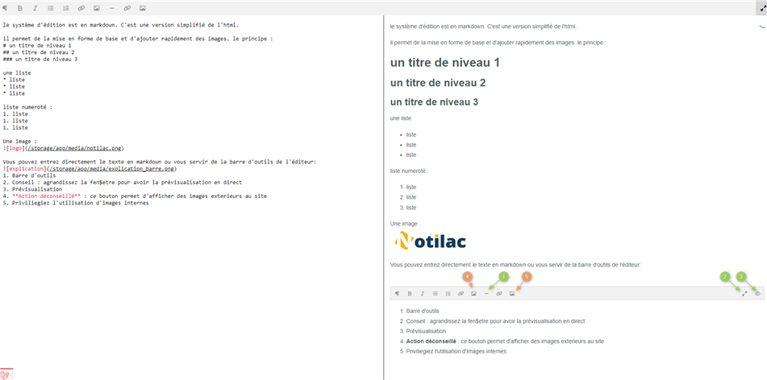

# Editer une page de la doc 
## Accès
l'accès se fait dans règlage ( groupe SYSTÈME ) -> docummentations

 
## Editeur Markdown : 
le système d'édition est en markdown. C'est une version simplifié de l'html. 

il permet de la mise en forme de base et d'ajouter rapidement des images.

Vous pouvez entrez directement le texte en markdown ou vous servir de la barre d'outils de l'éditeur: 

1. Barre d'outils
2. Conseil : agrandissez la fenêtre pour avoir la prévisualisation en direct*

3. Prévisualisation
4. **Action déconseillé** : ce bouton permet d'afficher des images exterieurs au site
5. Priviliegiez l'utilisation d'images internes 
 
*exemples prévisualisation en direct<br>


## Syntaxe du Markdown : 
### titre
```
# un titre de niveau 1
## un titre de niveau 2
### un titre de niveau 3
```
**donnera** 

# un titre de niveau 1
## un titre de niveau 2
### un titre de niveau 3
---
## Liste à puces
```
une liste
* liste
* liste
* liste
```
**donnera**

une liste
* liste
* liste
* liste

---

### Liste numeroté
```
liste numeroté :
1. liste
2. liste
3. liste
```
**donnera**

liste numeroté :
1. liste
2. liste
3. liste

## Sauts de lignes 
Les sauts de lignes peuvent être capricieux en markdown. 
Si le resultat n'est pas bon vous pouvez ajouter ```<br>``` à la fin d'une ligne pour forcer le saut de ligne. 
```
Une ligne
Une autre ligne
```
**donnera**

Une ligne
Une autre ligne

```
Une ligne<br>
Une autre ligne

ou 
Une ligne

Une autre ligne
```
**donnera**

Une ligne<br>
Une autre ligne
